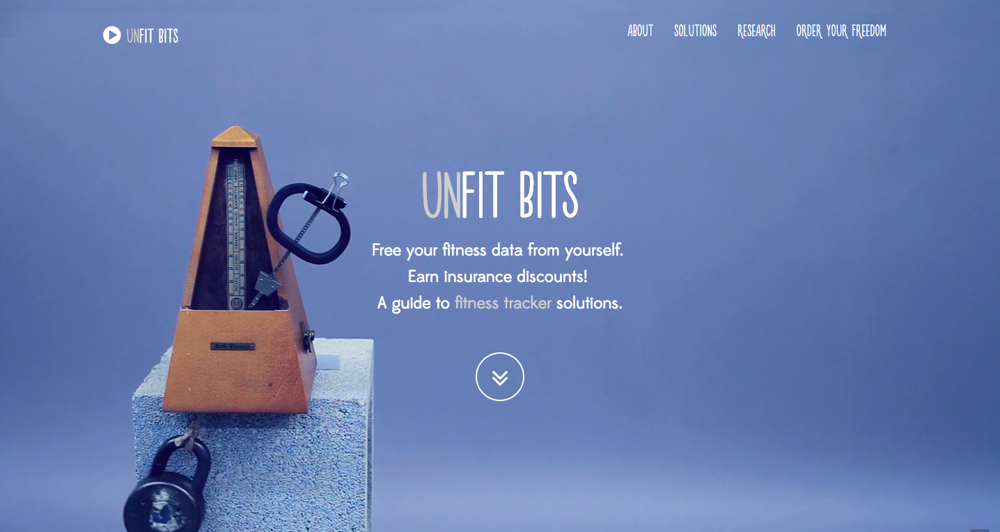
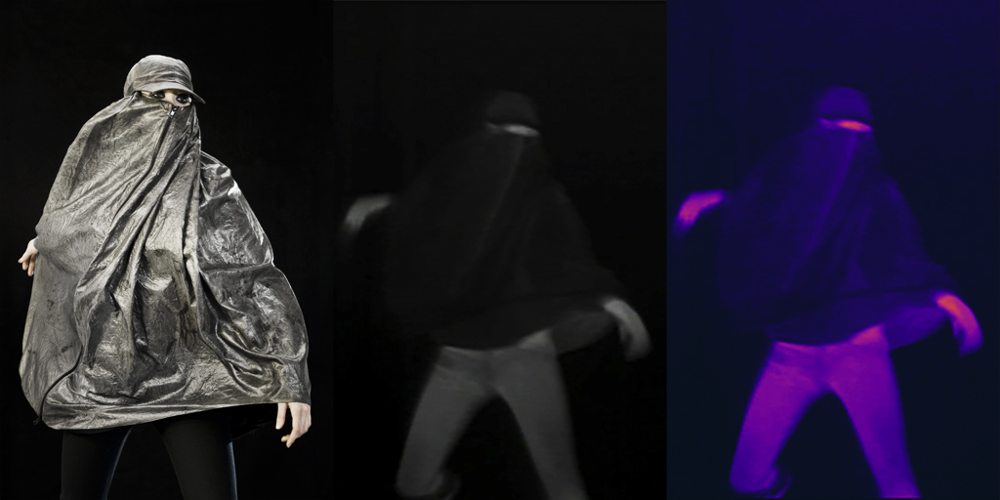
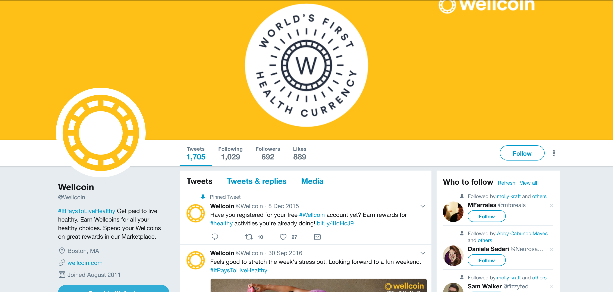
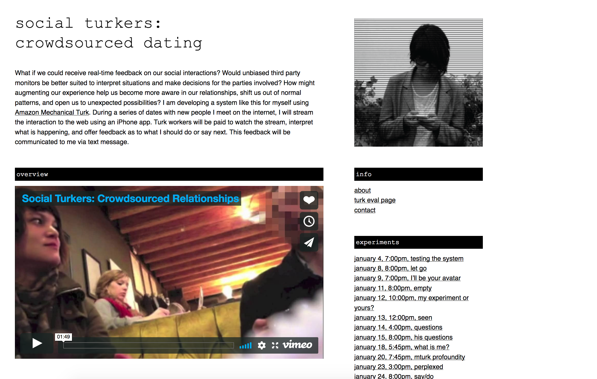

# WEEK `06`: MAR 11 2019
## Act: Interventions & Untracking 
> “This influx of money has meant that the ecology of the self-tracking industry now includes traditional technology giants, massive medical device companies, pharmaceutical companies, insurance companies, large hospital groups, and sportswear companies and luxury brands. These different kinds of companies have different agendas for wearable technologies and their associated data.” - Neff & Nafus

This week in Quant Humanists, we will look into the things that motivate behavior change. We will look into digital and physical interventions that are meant to keep us engaged, on track, on schedule, or empowered to make a change in our lives. Which interventions personally work for us? Which ones don’t? How can we use new technologies or relationships to create impactful interventions?

As we explore the things that motivate behavior change, we also look at the ways we can escape the gaze of our trackers. We will also examine how our trackers work, the limitations or intelligence in those measurements, and what ways we might hack our trackers to say different things. 

### MATERIALS
- SLIDES: https://docs.google.com/presentation/d/1AElZ1KpP-k41M8WoTY7ocDXeJu8OEcO159VxX98aA8c/edit?usp=sharing

### AGENDA

- Guest Speaker: [Daniel Goddemeyer](http://danielgoddemeyer.com/), A Creative Director for Data- and AI-driven Products.
- Attendance
- Assignment reviews
- Slide presentation

**Project Highlight**:

* [Unfitbits](http://www.unfitbits.com/)*, Tega Brain, Surya Mattu + collaborators

* [Stealth Wear](https://ahprojects.com/projects/stealth-wear/)*, Adam Harvey

* [Wellcoin](https://www.digitaltrends.com/health-fitness/wellcoin-health-currency-wearables/)

* [Social Turkers, Lauren McCarthy](http://socialturkers.com/)

* Eveleth, Rose [How Self-Tracking Apps Exclude Women](https://www.theatlantic.com/technology/archive/2014/12/how-self-tracking-apps-exclude-women/383673/)

## READINGS

### Interventions 
- Ruckenstein, Minna., [Visualized and interacted life: Personal analytics and engagements with data doubles](http://www.mdpi.com/2075-4698/4/1/68pdf)
- Bosker, Bianca., [WeCroak, The App That Reminds You You’re Going to Die
](https://www.theatlantic.com/magazine/archive/2018/01/when-death-pings/546587/)
- Kushner, R. and Mechanick, J. [Communication and Behavioral Change Tools: A Primer for Lifestyle Medicine Counseling](https://link.springer.com/chapter/10.1007/978-3-319-24687-1_3)
- Comm, Joel., [Top 10 Motivational Apps to help nail your resolutions](https://www.inc.com/joel-comm/top-10-motivational-apps-that-will-help-you-nail-your-resolutions.html)
- Clear, James., [How Long Does it Actually Take to Form a New Habit? (Backed by Science)](https://jamesclear.com/new-habit)
- Monteiro, Mike., [13 Ways Designers Screw Up Client Presentations](https://medium.com/@monteiro/13-ways-designers-screw-up-client-presentations-51aaee11e28c)

### Untracking
- Anonymous, [Kicking tracking, No Picnic](https://unquantifiedself.wordpress.com/2014/04/29/kicking-tracking-no-picnic/)
- Anonymous contributors + Dewey-Hagborg, Heather., [Bioanonymous](http://biononymous.me/)
- Ackerman, Linda, [Mobile Health and Fitness Applications and Information Privacy](https://www.privacyrights.org/sites/default/files/mobile-medical-apps-privacy-consumer-report.pdf)
- Mann S. and Ferenbok J., [New media and the power politics of sousveillance in a asurveillance-dominated world](https://ojs.library.queensu.ca/index.php/)
- Anonymous, [Internet Chemotherapy](https://ghostbin.com/paste/q2vq2)
- Sweeney, Latanya, [My Phone At Your Service](https://www.ftc.gov/news-events/blogs/techftc/2014/02/my-phone-your-service)
- van Dijck, José., [Datafication, datism and dataveillance: big data between scientific paradigm and ideology](https://ojs.library.queensu.ca/index.php/surveillance-and-society/article/view/datafication)

## ADDITIONAL RESOURCES

- Eveleth, Rose [How Many Photographs of You Are Out There In the World?](https://www.theatlantic.com/technology/archive/2015/11/how-many-photographs-of-you-are-out-there-in-the-world/413389/)
- Eveleth, Rose [There is no, 'off the record'](https://www.wnycstudios.org/story/transcript-recorded-future-flash-forward)
- Goldsmith, Marshall., [An exercise in behavioral change](https://hbr.org/2010/01/an-exercise-in-changing-yourse)
- Grave, Calugi, Centis, El Ghoch, Marchesini., [Cognitive-Behavioral Strategies to Increase the Adherence to Exercise](https://www.ncbi.nlm.nih.gov/pmc/articles/PMC2968119/)
- [Coach.me](https://www.coach.me/) - app to track your momentum toward a goal
- [Get Gratitude](http://getgratitude.co/) - journaling tool to motivate change and thankfulness
- [Think Up](https://itunes.apple.com/us/app/thinkup-positive-affirmations/id906660772?mt=8) - an app to personalize your positive affirmations and schedule reminders
- King, Stephen., [Cat’s Eye - Quitters Inc. (1985)](https://www.youtube.com/watch?v=-2w7ksD0ZlE)
- Berson, Josh., [Computable Bodies: Instrumented Life and the Human Somatic Niche](https://www.bloomsbury.com/uk/computable-bodies-9781472527622/)
- Williams, Kaiton., [The weight of things lost: self-knowledge and personal informatics](http://www.personalinformatics.org/docs/chi2013/williams.pdf)
- [Beeminder, using behavioral economics to keep you on track](https://www.beeminder.com/)
- [Moves App bought by Facebook visualized in Carto](https://carto.com/blog/moves-bought-by-facebook-visualized-by-cartodb/)
- [Katherine Dillion & Su Kim, ITP Designing Meaningful Interactions Course Materials](https://itp.nyu.edu/~kd49/ux/)
- [Sensors for personalized statistics in soccer](http://gadgetsandwearables.com/2018/02/02/soccer-training-sensor/)
- [Persuasive Tech, Stanford](http://captology.stanford.edu/)

## ⚠️ IMPORTANT NOTE: Field Trip to Mt. Sinai, next week!

We are meeting at Mt. Sinai next week to meet with Jason Bobe and Ryan Viglizzo to chat about innovations in biomedical research, the consent processes in biomedical research (and consent for research studies in general), and more.  We will meet at the usual meeting time: 6:30PM at Mt.Sinai up on 60 th street & Lexington Ave.

**Directions from ITP**:
- Take the **6 train** from Astor Pl UPTOWN to 59 St-Lexington Av Station. 

**Address**:
770 Lexington @ 60th Street, 14th floor, Manhattan
- [google maps link](https://www.google.com/maps/place/770+Lexington+Ave+14th+floor,+New+York,+NY+10065/@40.7631599,-73.9700766,17z/data=!3m1!4b1!4m5!3m4!1s0x89c258ef7b9b6797:0x390b12ebd725a14!8m2!3d40.7631599!4d-73.9678826)

## ASSIGNMENT 5 (DUE: WEEK `07`, 25 MAR 2019)

This week your assignment is to design a quantified self intervention. In this case, an intervention can any kind of trigger (e.g. push notifications, phone calls from friends, money donations or deductions) that helps to keep you on track with your habits, provides motivation, punishes you, etc. Think about the deeper underlying principles that motivate you, how various services play on those principles, and how you might (ab)use those principles in your own intervention design. 

### Quant Self Intervention
- **About**:  
-  Design or prototype an intervention that would help you to change your behavior based on the data you've gathered. Technical or community or social based interventions are fair game.
-  You will:
 - make your intervention tangible; make it visual or physical in some way. 
 - justify how your intervention works and why it is convinving for you and why it might (or might not) be a useful strategy for others.

**Your intervention should either:**

1. respond to data you submit regarding a goal you want to achieve the next couple weeks OR
2. that prompts you to interact or reminds you to submit data or self-log in some way. 

**You might consider the use of:**

- paper prototypes, a slide deck, a screen dummy, video, something physical etc
- designing and sketching, developing, and testing, and iterating on those changes
- some of these ideas:
  - using a charting library to help you create interactive charts
  - designing geofences that respond to your location
  - voice or auditory feedback (think: Rock Alarm clock)
  - award system concepts, monetary or otherwise e.g. Well Coin

- **Submission**: Submit documentation of your quant self intervention - including images, graphics, text descriptions, etc - as a Github Gist/blog post link as a [`comment in its respective github issue` in the quant-humanists-2019 repository](https://github.com/joeyklee/quant-humanists-2019/issues). See NOTE below.

